## 拆分计划详情

### 一、模块依赖关系图

```mermaid
graph TD
    subgraph server[eqochat-server 启动壳]
        S[EqoChatApplication]
        C[全局配置]
    end
    
    subgraph framework[eqochat-framework 技术层]
        FW1[framework-common]
        FW2[framework-redis]
        FW3[framework-datasource]
        FW4[framework-security]
        FW5[framework-sms]
        FW6[framework-file]
        FW7[framework-websocket 新建]
    end
    
    subgraph business[eqochat-business 业务层]
        U1[user-api]
        U2[user 实现模块]
        W1[world-api]
        W2[world 实现模块]
        C1[chat-api]
        C2[chat 实现模块]
        CT1[contact-api]
        CT2[contact 实现模块]
        P1[project-api]
        P2[project 实现模块]
        A1[agent-api]
        A2[agent 实现模块]
        CR1[credit-api]
        CR2[credit 实现模块]
        N1[notification-api]
        N2[notification 实现模块]
    end
    
    server --> U1
    server --> W1
    server --> C1
    server --> CT1
    server --> P1
    server --> A1
    server --> CR1
    server --> N1
    
    U2 --> U1
    U2 --> FW1
    
    W2 --> W1
    W2 --> U1
    W2 --> CT1
    W2 --> FW1
    
    C2 --> C1
    C2 --> U1
    C2 --> CT1
    C2 --> FW7
    
    CT2 --> CT1
    CT2 --> U1
    CT2 --> FW1
    
    P2 --> P1
    P2 --> U1
    P2 --> A1
    P2 --> FW1
    
    A2 --> A1
    A2 --> U1
    A2 --> FW1
    
    N2 --> N1
    N2 --> U1
    N2 --> FW1
```

---

### 二、各模块迁移详情

#### 1. 创建 eqochat-framework-websocket（新模块）

**迁移类**（从 eqochat-server/websocket）：

| 类名                      | 说明             | 目标路径                           |
| ----------------------- | -------------- | ------------------------------ |
| WebSocketMessage        | WebSocket 消息协议 | `framework-websocket/message/` |
| WebSocketSessionManager | 会话管理器          | `framework-websocket/session/` |
| WebSocketSender         | 发送工具           | `framework-websocket/sender/`  |

---

#### 2. eqochat-user 模块

**Entity（8个）** → `eqochat-user/entity/`：

- UserProfile、UserAuthRecord、UserFollow、UserFriend
- UserContactTag、DidDocument、DidVerification、ViolationRecord

**DTO** → `eqochat-user-api/dto/`：

- Request：LoginRequest、EmailLoginRequest、RegisterRequest、EmailRegisterRequest、VerifyCodeRequest、EmailVerifyCodeRequest
- Response：LoginResponse、UserInfoResponse、UserPublicProfileResponse、UserSearchResponse

**Mapper（8个）** → `eqochat-user/mapper/`：

- UserProfileMapper、UserProfileCustomMapper、UserAuthRecordMapper
- UserFollowMapper、UserFriendMapper、UserContactTagMapper
- DidDocumentMapper、DidVerificationMapper

**Controller（2个）** → 按子功能分包：

| Controller     | 目标路径                  |
| -------------- | --------------------- |
| AuthController | `controller/auth/`    |
| UserController | `controller/profile/` |

**Service（4接口+4实现）** → `eqochat-user/service/`：

- AuthService、UserService、UserProfileService、UserSessionService

---

#### 3. eqochat-world 模块（拆分 Controller）

**Entity（7个）** → `eqochat-world/entity/`：

- WorldPost、WorldTopic、WorldPostReply、WorldPostUpvote
- WorldPostMention、WorldTopicFollow、WorldPostReplyUpvote、WorldPostTopic

**DTO** → `eqochat-world-api/dto/`：

- Request：CreateWorldPostRequest、CreateWorldPostReplyRequest
- Response：WorldPostResponse、WorldPostReplyResponse、WorldTopicResponse、WorldShareLinkResponse

**Mapper（9个）** → `eqochat-world/mapper/`：

- WorldPostMapper、WorldPostReplyMapper、WorldPostMentionMapper
- WorldPostTopicMapper、WorldPostUpvoteMapper、WorldPostReplyUpvoteMapper
- WorldTopicMapper、WorldTopicFollowMapper

**Controller 拆分**：

| 原Controller     | 拆分后                  | 目标路径                            |
| --------------- | -------------------- | ------------------------------- |
| WorldController | WorldController      | `controller/world/` - 动态列表、我的动态 |
| WorldController | WorldPostController  | `controller/post/` - 帖子创建、详情、分享 |
| WorldController | WorldTopicController | `controller/topic/` - 话题列表、关注   |
| WorldController | WorldReplyController | `controller/reply/` - 回复创建、点赞   |

**Service（2接口+2实现）** → `eqochat-world/service/`：

- WorldService、WorldUploadService

---

#### 4. eqochat-chat 模块

**Entity（5个）** → `eqochat-chat/entity/`：

- Message、Conversation、ConversationParticipant
- MessageReaction、MessageReadReceipt

**DTO** → `eqochat-chat-api/dto/`：

- Request：SendMessageRequest、CreateConversationRequest、MarkConversationReadRequest
- Response：MessageResponse、MessagePageResponse、MessageAttachmentResponse、ConversationSummaryResponse

**Mapper（5个）** → `eqochat-chat/mapper/`：

- MessageMapper、ConversationMapper、ConversationParticipantMapper
- MessageReactionMapper、MessageReadReceiptMapper

**Controller** → `controller/conversation/`：

- ConversationController

**Service（3接口+3实现）** → `eqochat-chat/service/`：

- MessageService、ConversationService、ConversationParticipantService

**WebSocket Handler** → `eqochat-chat/websocket/`：

- ChatWebSocketHandler、WebSocketMessageHandler、ChatMessageRealtimeNotifier

---

#### 5. eqochat-contact 模块

**Entity（3个）** → `eqochat-contact/entity/`：

- FriendRequest、GroupProfile、GroupMember

**DTO** → `eqochat-contact-api/dto/`：

- Request：AddContactRequest、UpdateContactTagsRequest、SendFriendRequestRequest
- Response：ContactResponse、ContactDetailResponse、FriendRequestResponse

**Mapper（5个）** → `eqochat-contact/mapper/`：

- FriendRequestMapper、GroupProfileMapper、GroupMemberMapper

**Controller** → 按子功能分包：

| Controller              | 目标路径                  |
| ----------------------- | --------------------- |
| ContactController       | `controller/friend/`  |
| FriendRequestController | `controller/request/` |

**Service（2接口+2实现）** → `eqochat-contact/service/`：

- ContactService、FriendRequestService

---

#### 6. eqochat-project 模块

**Entity（5个）** → `eqochat-project/entity/`：

- Project、ProjectTask、ProjectMember、ProjectFile、ProjectPayment

**DTO** → `eqochat-project-api/dto/`：

- Request：CreateProjectRequest、CreateProjectTaskRequest、UpdateProjectBidRequest、TransferProjectOwnershipRequest
- Response：ProjectDetailResponse、ProjectSummaryResponse、ProjectTaskResponse、ProjectMemberResponse、ProjectFileResponse、ProjectPaymentResponse、ProjectShareLinkResponse

**Mapper（5个）** → `eqochat-project/mapper/`：

- ProjectMapper、ProjectTaskMapper、ProjectMemberMapper、ProjectFileMapper、ProjectPaymentMapper

**Controller** → `controller/project/`：

- ProjectController

**Service（1接口+1实现）** → `eqochat-project/service/`：

- ProjectService

---

#### 7. eqochat-agent 模块

**Entity（2个）** → `eqochat-agent/entity/`：

- AgentProfile、AgentBinding

**DTO** → `eqochat-agent-api/dto/`：

- Response：AgentMeResponse

**Mapper（2个）** → `eqochat-agent/mapper/`：

- AgentProfileMapper、AgentBindingMapper

**Controller** → `controller/`：

- AgentController

---

#### 8. eqochat-credit 模块

**Entity（1个）** → `eqochat-credit/entity/`：

- CreditRecord

**DTO** → `eqochat-credit-api/dto/`：

- Response：CreditProfileResponse

**Mapper（1个）** → `eqochat-credit/mapper/`：

- CreditRecordMapper

**Controller** → `controller/`：

- CreditController

**Service（1接口+1实现）** → `eqochat-credit/service/`：

- CreditProfileService

---

#### 9. eqochat-notification 模块

**Entity（3个）** → `eqochat-notification/entity/`：

- Notification、OperationLog、SystemConfig

**DTO** → `eqochat-notification-api/dto/`：

- Request：MarkNotificationReadRequest
- Response：NotificationResponse

**Mapper（2个）** → `eqochat-notification/mapper/`：

- NotificationMapper、OperationLogMapper、SystemConfigMapper

**Controller** → `controller/`：

- NotificationController

**Service（1接口+1实现）** → `eqochat-notification/service/`：

- NotificationService

---

#### 10. eqochat-server 最终保留内容

**仅保留**：

- `EqoChatApplication.java` - 启动类
- `config/` - 全局配置（SecurityConfig、WebSocketConfig、MyBatisPlusConfig 等）
- `controller/HealthController.java` - 健康检查
- `controller/FileController.java` - 文件上传（可选移入 framework-file）

**删除**：

- 所有业务 Controller、Service、Entity、Mapper、DTO

---

### 三、Package 命名规范

| 模块类型      | Package 格式                           |
| --------- | ------------------------------------ |
| API 模块    | `com.eqochat.business.{模块}.api.{子包}` |
| 实现模块      | `com.eqochat.business.{模块}.{子包}`     |
| Framework | `com.eqochat.framework.{子模块}.{子包}`   |

**示例**：

- Entity：`com.eqochat.business.user.entity.UserProfile`
- DTO：`com.eqochat.business.user.api.dto.response.LoginResponse`
- Controller：`com.eqochat.business.user.controller.auth.AuthController`
- Service：`com.eqochat.business.user.service.UserService`

---

### 四、执行顺序

1. **Phase 1** - Framework 层：创建 `eqochat-framework-websocket` 模块
2. **Phase 2** - Entity 迁移：从 eqochat-core 迁移到各业务模块
3. **Phase 3** - DTO 迁移：Request/Response 迁移到各 -api 模块
4. **Phase 4** - Mapper 迁移：从 eqochat-core 迁移到各业务模块
5. **Phase 5** - Service 迁移：接口到 -api，实现到业务模块
6. **Phase 6** - Controller 迁移：按子功能分包到各业务模块
7. **Phase 7** - 更新依赖：修改所有 import 和 pom.xml
8. **Phase 8** - 清理：删除 eqochat-core，更新 eqochat-server
9. **Phase 9** - 验证：`mvn clean install` 和启动测试

---

### 五、文件统计

| 类别           | 总数  | 迁移目标            |
| ------------ | --- | --------------- |
| Entity       | 35  | 8个业务模块          |
| DTO Request  | 19  | 7个 -api 模块      |
| DTO Response | 25  | 8个 -api 模块      |
| Mapper       | 36  | 8个业务模块          |
| Controller   | 12  | 7个业务模块 + server |
| Service接口    | 15  | 7个 -api 模块      |
| Service实现    | 15  | 7个业务模块          |

